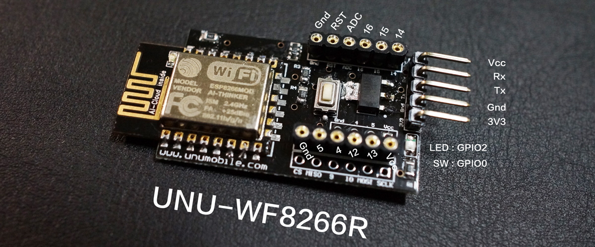

WF8266R 使用手冊 
=======

歡迎選購 WF8266R 開發板, WF8266R 是一款基於 ESP8266 晶片設計的物聯網開發實驗板, 同時也是一款智慧家電的套件, 透過 WF8266R 所提供的各項服務讓你立即透過 App 控制家裡的設備。同時 WF8266R 提供了相當豐富的 Web API, 只需用網頁就能簡單控制與開發最潮的 IoT 應用。

## WF8266R 特色

* 線上教學平台， 強化學習互動，每個單元下方都有互動討論區，立即取得協助
* 提供多樣化的 API 及 雲端服務平台
* 使用 WEB 開發技術 HTML5, Javascript, CSS, WebSocket 操作 WF8266R
* 進階 MAKER 可以使用 Arduino IDE 開發 WF8266R, 就像開發 Arduino 一樣, 無痛轉換
* 可加掛 BLE4.0 模組，實現 iBeacon
* WF8266R 使用 序列 Rx Tx 可和其他設備 如：藍芽 Arduino 等等進行資料交換
* 直接掛載於 2 或 4 路繼電器, 透過 事件 指定實現 定時 延遲 自鎖 循環 等任意組合
* 專用的手機 App 支援 iOS 和 Android
