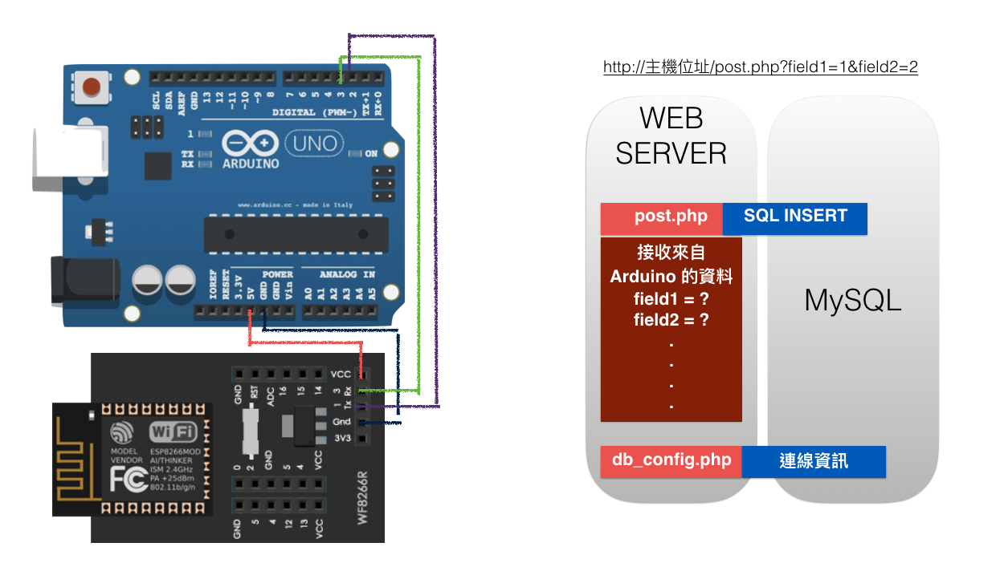

Arduino 寫入資料到 MySQL
=======

WF8266R 提供了 WT+POST 和 WT+GET 指令可讓 Arduino 等MCU利用 UART 傳送資料到指定伺服器。這個範例示範了如何由 Arduino 發送資料到服務器的 post.php 程式，再由 post.php 利用 SQL INSERT 語句將收到的資料寫入 MySQL 資料庫。

## WT+ 指令教學
http://wf8266.com/wf8266r/tutorials/0A_WT
=======
## 如何開始
STEP1 : 修改 php 目錄中的 db_config.php 的連線資訊和資料庫名稱
STEP2 : 修改 post.php 中 SQL INSERT 語法

