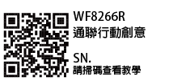
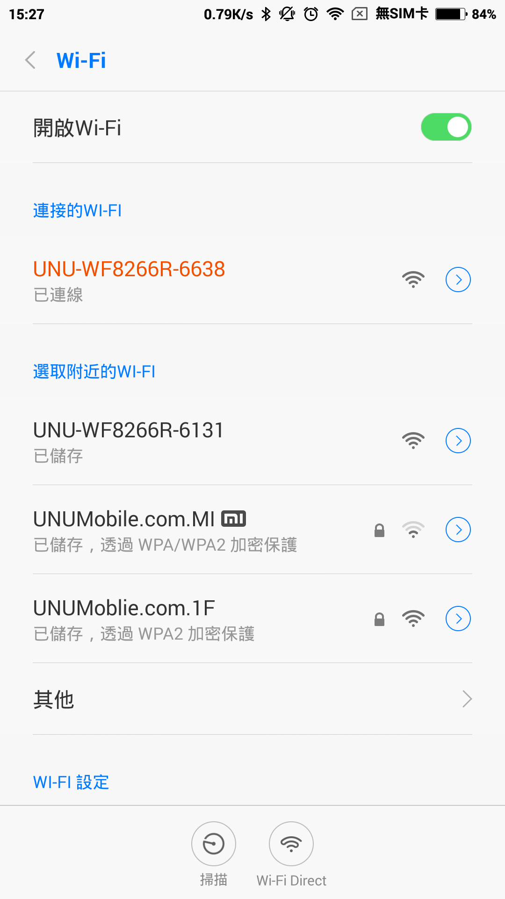
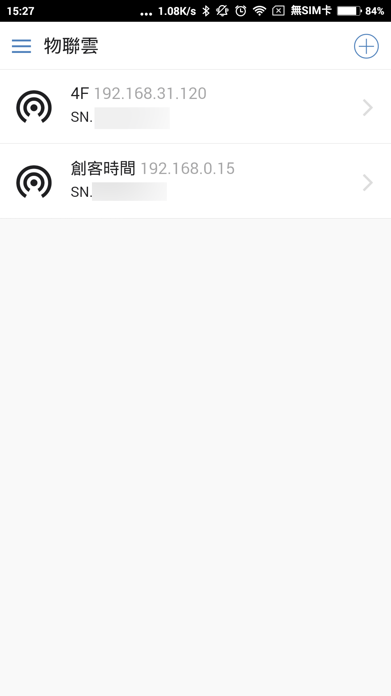
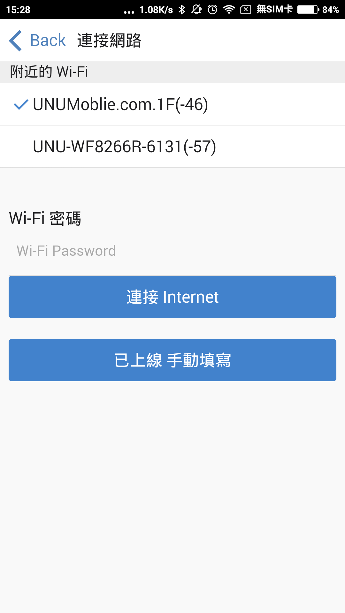
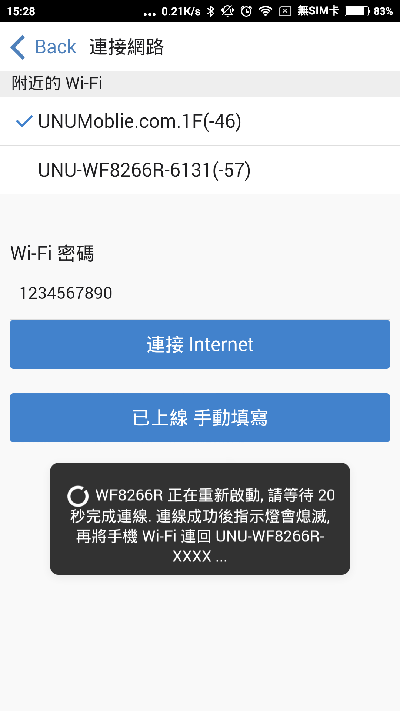
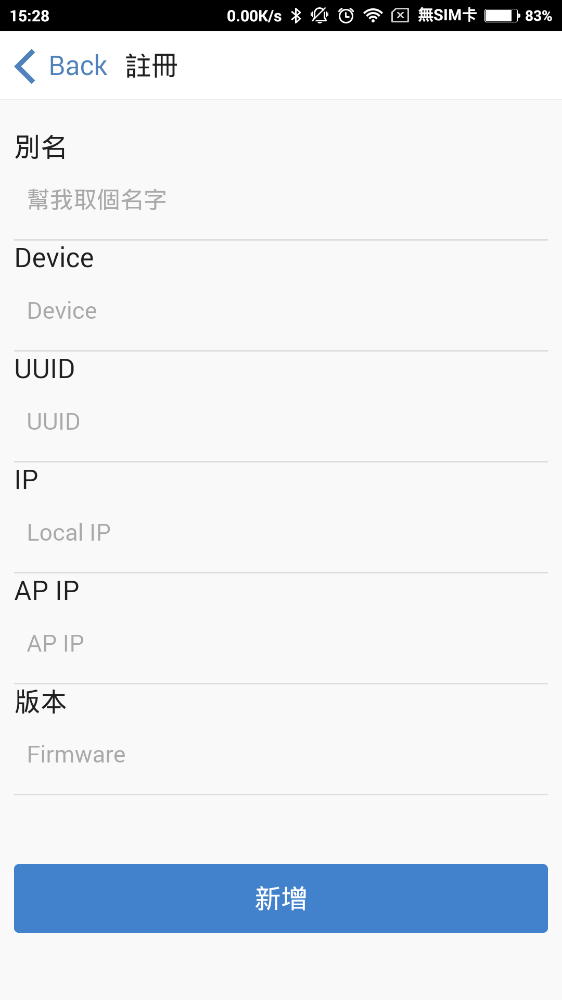
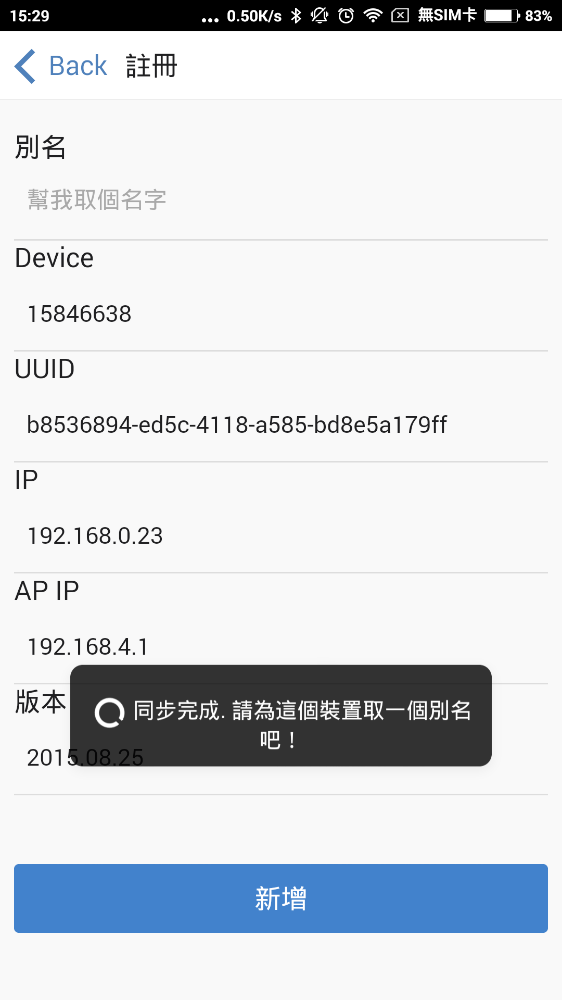
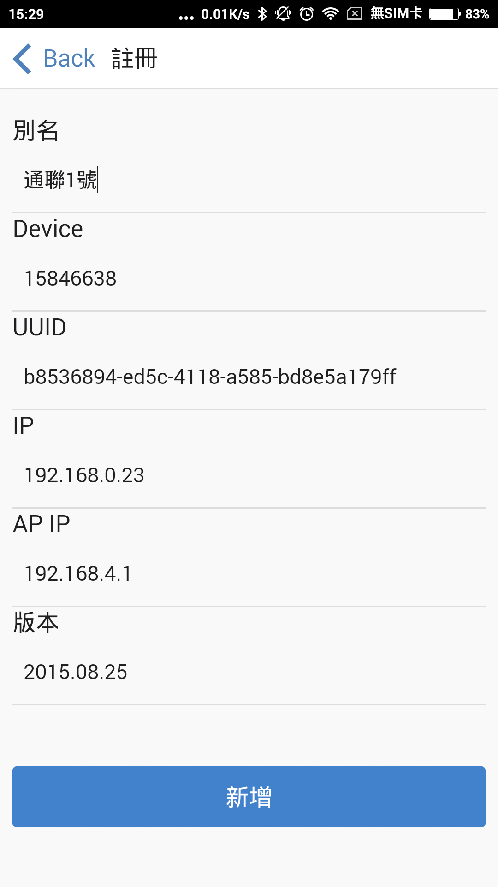
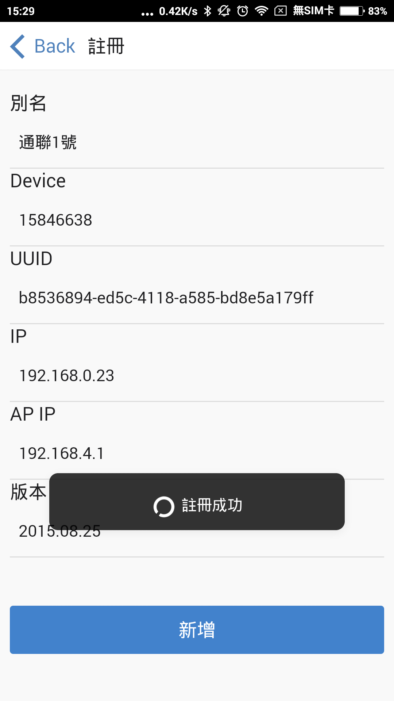
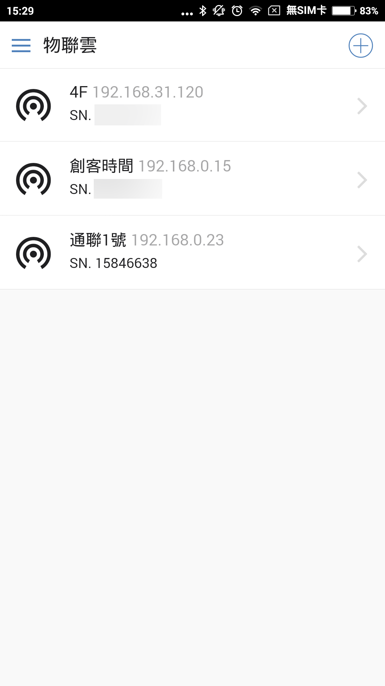

# WF8266R 連線上網
請將WF8266R接上 5V 電源，未上網情況下指示燈會閃動，表示等待連線中。在包裝袋可以找到裝置的唯一編碼，請勿將序號公開以確保安全性。
## 與 WF8266R 建立連線

如上圖所示 SN. XXXXOOOO 其中後4碼 OOOO 會顯示在 AP 名稱，例如這個範例後4碼為 6638 打開手機 Wi-Fi 連接 UNU-WF8266R-6638 直接連線 WF8266R。

## 物聯雲 APP
請打開 WF8266R 物聯雲 APP，並按右上角 ＋ 號新增設備。

## 決定連線 AP 
等待幾秒後會自動帶出附近的前5個 AP，點選要透過哪個 AP 連上 Internet 區域網路(內網)。填上 密碼 之後按下 連接Internet。
更新：下拉可以更新畫面。

*重要：WF8266R 支援 2 組 Wi-Fi 連線設定，方便在換地方時不用再設定連線

第一次連接的 AP 會存在永久區，除了 RESET 外都不會被更改。之後的連線會存在暫時連線區，只要重新設定連線都會覆蓋此區。*

## 連回 WF8266R AP
按下連線後 WF8266R 會重新開機，手機的WI-FI連線有可能會跳開，請再確定目前連線的 WI-FI 是 WF8266R 的 AP 名稱。

## 連回 WF8266R AP
等待 WF8266R 重新開機後，會看到註冊畫面，如果目前 WI-FI 不是連到 WF8266R AP 的話，將無法自動帶出裝置訊息。

此時，請先確定 WI-FI 連接到 UNU-WF8266R-XXXX，並下拉畫面更新，如果連線正確即可帶出裝置資訊。

## 命名
最後新為這個裝置取一個名稱並按下新增即可完成設定。

## 完成

