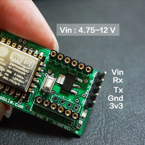
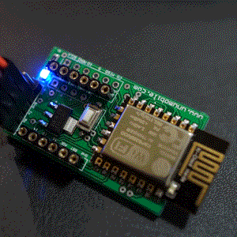
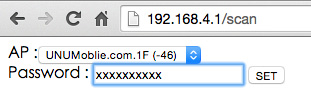
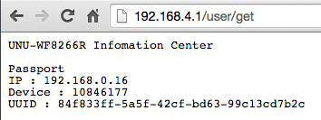

# 基礎篇 ： 連上網際網路

當你拿到 WF8266R 時第一步就是接上電源，這裡有幾個腳位要請你看清礎，如果接錯了是會燒壞 WF8266R 的。

## 接上電源

請在 Vin 腳位接上 4.75 ~ 12 V 的直流電源正級, 和 Gnd 腳接上直流電源負級即可工作. 這裡要注意, 如果不小心接反超過5秒會燒壞整流晶片.

 另外 3V3 是輸出, 如果要做為輸入時請不要接 Vin 腳, 但要注意輸入電源是否為穩定的3V3而且最大電流要到 400mA, 這樣 ESP8266 才能穩定工作. 因此，如果你用 Arduino 等等的單晶片供電是沒辦法穩的的哦。

 Rx / Tx 主要提供燒寫程序時使用, 或是外接其他單晶片(Arduino, ARM, 或電腦)時可用來做序列傳輸交換資料使用.
 

## 指示燈

第一次接上電源時會看到指示燈 1 秒閃一次， 表示開機成功並且等待設定網路連線中。此時請透過無線網路直接和 WF8266R 連結設定，或是可以透過手機 APP 進行初始設定。

## 設定

* 打開無線網路, 會看到一串名為 UNU-WF8266R-XXXX 的AP, 其中 XXXX 是每個專屬 ID 的後4碼, 預設密碼空白, 請直接連線即可.
* 打開瀏覽器, 在網址列輸入 192.168.4.1 會要求您設定 WF8266R 要透過哪一台 AP 連上 Internet.

* 按下 SET 後 WF8266R 會重新開機, 此時請注意指示燈, 當指示亮沒有亮時表示已連上 Internet, 您可以再輸入一次 192.168.4.1 看看是否能看到裝罝資訊. 

