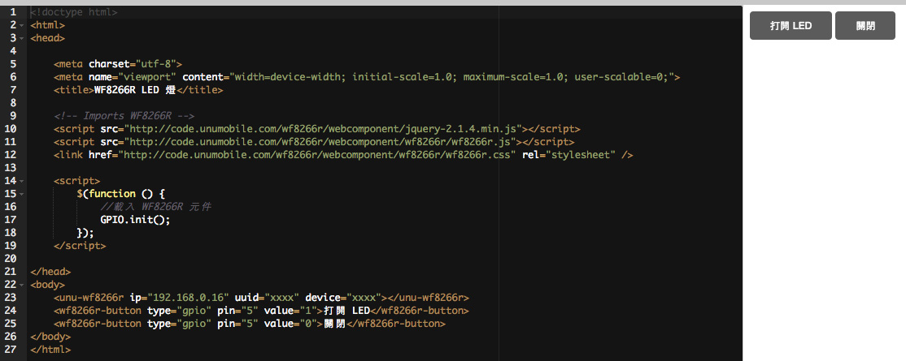

# 基礎篇 ： 點亮 LED


透過 LED 的亮滅來學習 GPIO 腳位輸出 高電位 和 低電位. 就像水往低處流, 當我們控制 PIN5 腳輸出高電位時, 電流由 LED 正腳位(長;Pin5)流向負腳位(短;Gnd) LED 便會亮起; 反之, 當 PIN5 輸出為低電位時, LED 二腳間是相等的低電位, 不會有流動產生, 所以 LED 自然就不會亮.


## 材料


* LED x 1
* WF8266R x 1


## 配線


**LED 長的接 PIN5 短的接 GND**

在 WF8266R 開發板下面有6的小圓孔, 由左到右分別是 GND 5 4 12 13 VCC


## 程式
為了讓不是很懂程式的人也可以輕鬆上手, 我們將 Web API 包裝成 <wf8266r-button> 標籤, 只需要透過 標籤(TAG) 的定義就能使用. 而且可在任何裝置上瀏覽自行設計的控制頁哦.

PS:我們另外準備了進階的課程， 請參考 Meet Arduino IDE

```
<wf8266r-button type="腳位類型" pin="編號" value="值">說明</wf8266r-button>```

type

* gpio : 數位輸出
* pwm : 數位類比輸出
* read : 讀取腳位
* adc : 類比輸入

當我希望按下時將 PIN5 腳輸出高電位, 這樣會使 LED 燈起, 我只要定義如下 TAG

```
<wf8266r-button type="gpio" pin="5" value="1">打開 LED</wf8266r-button>```

現在 LED 已經亮燈了, 再加一個按鍵把它關了吧. 只要將 value 改為 0 即可

```<wf8266r-button type="gpio" pin="5" value="0">關閉</wf8266r-button>```


## 完整範例
```
<!doctype html>
<html>
<head>

    <meta charset="utf-8">
    <meta name="viewport" content="width=device-width; initial-scale=1.0; maximum-scale=1.0; user-scalable=0;">
    <title>WF8266R LED 燈</title>

    <!-- Imports WF8266R -->
    <script src="http://code.unumobile.com/wf8266r/webcomponent/jquery-2.1.4.min.js"></script>
    <script src="http://code.unumobile.com/wf8266r/webcomponent/wf8266r/wf8266r.js"></script>
    <link href="http://code.unumobile.com/wf8266r/webcomponent/wf8266r/wf8266r.css" rel="stylesheet" />

    <script>      
        $(function () {
            //載入 WF8266R 元件
            GPIO.init();
        });
    </script>

</head>
<body>
    <unu-wf8266r ip="192.168.0.16" uuid="xxxx" device="xxxx"></unu-wf8266r>
    <wf8266r-button type="gpio" pin="5" value="1">打開 LED</wf8266r-button>
    <wf8266r-button type="gpio" pin="5" value="0">關閉</wf8266r-button>
</body>
</html>```


## 線上練習
請點圖片進入線上練習平台，試著改改 pin 的數字 
[](http://code.unumobile.com/wf8266r/Default?templateName=02_Light.html)
