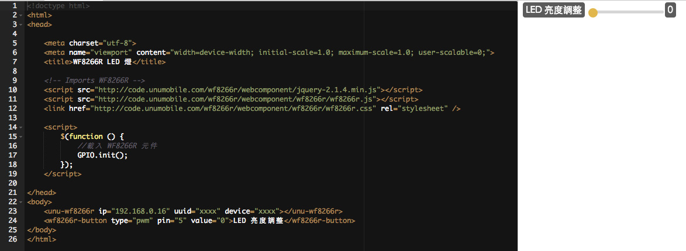

# 基礎篇 ： LED亮度調整

上個單元我們學會了如何控制電的流動, 這個單元要介紹如何控制電的流量, 就和開水龍頭相同, 想要水大些你會把開關開大. 同樣的原理, 透過 PWM 可以控制這個流量, 當 PWM = 0 時最小, PWM = 1023 時最大.

PWM : Pulse Width Modulation, [脈衝寬度調變](https://zh.wikipedia.org/wiki/脈衝寬度調變).


## 程式
上個單元我們透過 type="gpio" 來控制輸出, 這次我們要換成 type="pwm" 來控制流量, 先來看看定義

```
<wf8266r-button id="控制編號" type="pwm" pin="腳位" value="預設值">顯示名稱</wf8266r-button>```

當我希望控制 PIN5 腳輸出的流量時, 我只要定義如下 TAG

```
<wf8266r-button type="pwm" pin="5" value="0">LED 亮度調整</wf8266r-button>```


## 完整範例

```javascript
<!doctype html>
<html>
<head>

    <meta charset="utf-8">
    <meta name="viewport" content="width=device-width; initial-scale=1.0; maximum-scale=1.0; user-scalable=0;">
    <title>WF8266R LED 燈</title>

    <!-- Imports WF8266R -->
    <script src="http://code.unumobile.com/wf8266r/webcomponent/jquery-2.1.4.min.js"></script>
    <script src="http://code.unumobile.com/wf8266r/webcomponent/wf8266r/wf8266r.js"></script>
    <link href="http://code.unumobile.com/wf8266r/webcomponent/wf8266r/wf8266r.css" rel="stylesheet" />

    <script>      
        $(function () {
            //載入 WF8266R 元件
            GPIO.init();
        });
    </script>

</head>
<body>
    <unu-wf8266r ip="192.168.0.16" uuid="xxxx" device="xxxx"></unu-wf8266r>
    <wf8266r-button type="pwm" pin="5" value="0">LED 亮度調整</wf8266r-button>
</body>
</html>```


## 線上練習

[](http://code.unumobile.com/wf8266r/Default?templateName=03_LightPWM.html)
