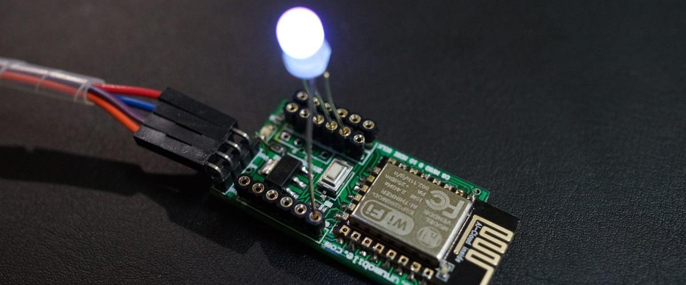
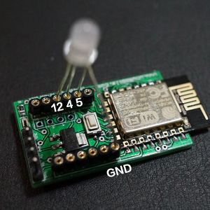
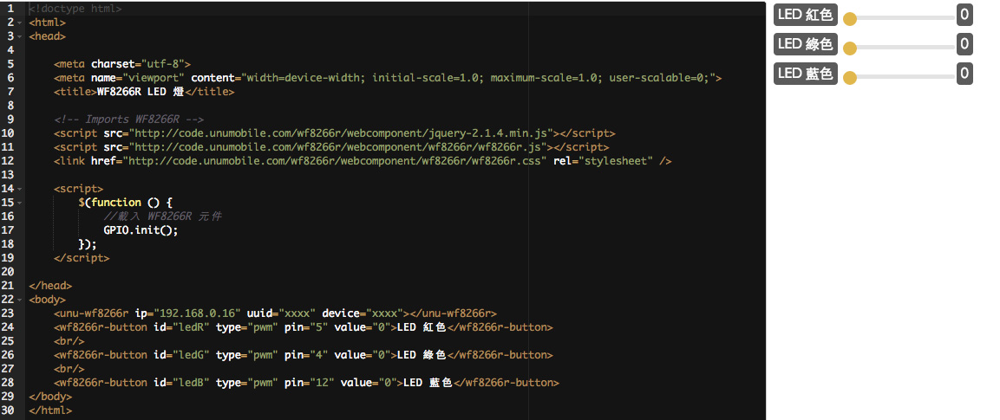

# 基礎篇 ： PWM調色


上個單元我們學會了控制流量, 這個單元我們把流量轉換為 RGB 調色控制, 就像 紅+綠 = 黃

RGB LED 燈的腳位由圖片上左到右分別是 Blue(藍) Green(綠) Common(共陰極) Red(紅)


## 材料

* RGB LED x 1
* WF8266R x 1
 

## 配線


**LED 最長的接 GND 短的由左到右接 12(B) 4(G) 5(R)**

這顆 RGB LED 是共陰極的規格, 所以最長的腳位是接 GND, 因此 GPIO 5 4 12 需要輸出高電位才可將LED點亮.


## 程式


上個單元我們透過 type="pwm" 來控制輸出流量, 這次增加為3組 PWM 控制, 分別控制 RGB 這3個腳位的輸出流量.

如下範例, 請增加為3組 PWM 並加上獨立的 id 命名, 分別控制 紅色(PIN5) 綠色(PIN4) 和 藍色(PIN12), 這樣就完成了, 立即點下面的圖示到實驗場測試看看吧.

```html
<wf8266r-button id="ledR" type="pwm" pin="5" value="0">LED 紅色</wf8266r-button>
<wf8266r-button id="ledG" type="pwm" pin="4" value="0">LED 綠色</wf8266r-button>
<wf8266r-button id="ledB" type="pwm" pin="12" value="0">LED 藍色</wf8266r-button>
```


## 完整範例

```html
<!doctype html>
<html>
<head>

    <meta charset="utf-8">
    <meta name="viewport" content="width=device-width; initial-scale=1.0; maximum-scale=1.0; user-scalable=0;">
    <title>WF8266R LED 燈</title>

    <!-- Imports WF8266R -->
    <script src="http://code.unumobile.com/wf8266r/webcomponent/jquery-2.1.4.min.js"></script>
    <script src="http://code.unumobile.com/wf8266r/webcomponent/wf8266r/wf8266r.js"></script>
    <link href="http://code.unumobile.com/wf8266r/webcomponent/wf8266r/wf8266r.css" rel="stylesheet" />

    <script>
        $(function () {
            //載入 WF8266R 元件
            GPIO.init();
        });
    </script>

</head>
<body>
    <unu-wf8266r ip="192.168.0.16" uuid="xxxx" device="xxxx"></unu-wf8266r>
    <wf8266r-button id="ledR" type="pwm" pin="5" value="0">LED 紅色</wf8266r-button>
    <br />
    <wf8266r-button id="ledG" type="pwm" pin="4" value="0">LED 綠色</wf8266r-button>
    <br />
    <wf8266r-button id="ledB" type="pwm" pin="12" value="0">LED 藍色</wf8266r-button>
</body>
</html>
```

## 線上練習


[](http://code.unumobile.com/wf8266r/Default?templateName=04_LightColor.html)