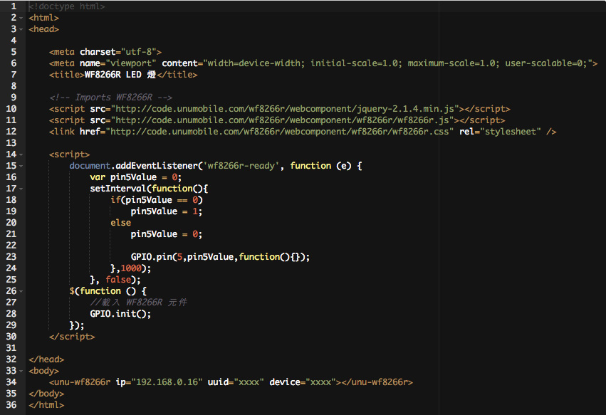

# 基礎篇 ： 閃亮 LED


之前的單元都學會了嗎, 接下來要讓 LED 燈閃動起來, 這個需要一點點程式幫忙. 這個單元你將學會如何透過程式來隨心控制 GPIO 而不必限制在前面的物件功能.


## 程式


別害怕, 雖然是程式但是很容易! 首先, 先來了解 wf8266r-ready 事件. 什麼是事件, 簡單來說就是當什麼條件成立時通知我. 例如:我早上8點要出門, 設了鬧鐘7:50, 所以事件就是 7:50 閙鐘會通知我, 接下來我要做的事情是準備出門.

wf8266r-ready 事件表示, WF8266R 已準備好了, 接下來你可以做自已的事. 至於做什麼? 就是要寫程式的地方.

```javascript
document.addEventListener('wf8266r-ready', function (e) {
    ...
}, false);
```

我們希望接在 GPIO5 腳位上的 LED 能每秒鐘閃動一下, 這要怎麼做呢? 答案是 setInterval 這個幫手, 把他想成一個計時器, 你可以指定它多久做一次事情.

```javascript
setInterval(function(){
    要做的事情寫在這裡
},毫秒);
```

現在讓我們想想, 1秒鐘要切換一個狀態, 所以我需要一個變數, 給個名字叫 pin5Value 用來存放目前 GPIO5 腳的電位值是高(1)或低(0).

然後要判斷 如果是高電位 就把 pin5Value 設成低, 反之設為高. 如此就會有 高低高低 ... 一直這樣變化下去, 而這個時間就是 1000 毫秒 也就是 1 秒鐘.

```javascript
var pin5Value = 0;
setInterval(function(){
    if(pin5Value == 0)
        pin5Value = 1;
    else
        pin5Value = 0;

        GPIO.pin(5,pin5Value,function(){}); //將目前存在 pin5Value 裡的高或低電位送到 PIN5 腳 
    },1000);
```


## 完整範例
```html
<!doctype html>
<html>
<head>

    <meta charset="utf-8">
    <meta name="viewport" content="width=device-width; initial-scale=1.0; maximum-scale=1.0; user-scalable=0;">
    <title>WF8266R LED 燈</title>

    <!-- Imports WF8266R -->
    <script src="http://code.unumobile.com/wf8266r/webcomponent/jquery-2.1.4.min.js"></script>
    <script src="http://code.unumobile.com/wf8266r/webcomponent/wf8266r/wf8266r.js"></script>
    <link href="http://code.unumobile.com/wf8266r/webcomponent/wf8266r/wf8266r.css" rel="stylesheet" />

    <script>
        document.addEventListener('wf8266r-ready', function (e) {
            var pin5Value = 0;
            setInterval(function(){
                if(pin5Value == 0)
                    pin5Value = 1;
                else
                    pin5Value = 0;

                    GPIO.pin(5,pin5Value,function(){});
                },1000);
            }, false);
        $(function () {
            //載入 WF8266R 元件
            GPIO.init();
        });
    </script>

</head>
<body>
    <unu-wf8266r ip="192.168.0.16" uuid="xxxx" device="xxxx"></unu-wf8266r>
</body>
</html>
```

## 線上練習


[](http://code.unumobile.com/wf8266r/Default?templateName=05_LightShiny.html)
