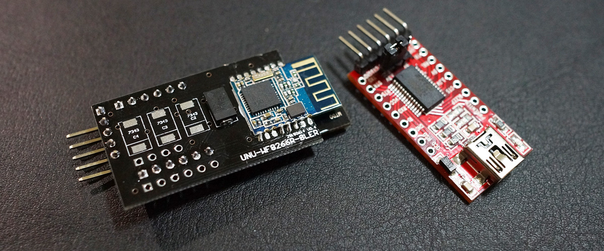
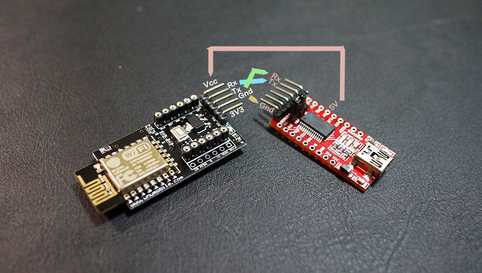
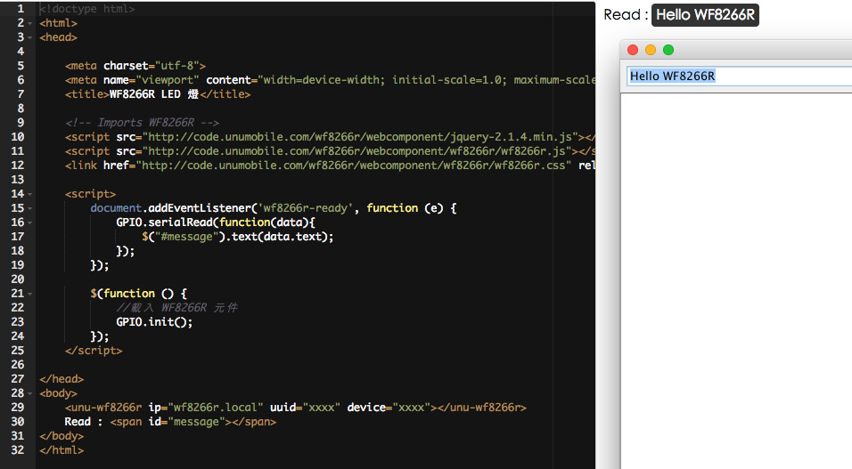
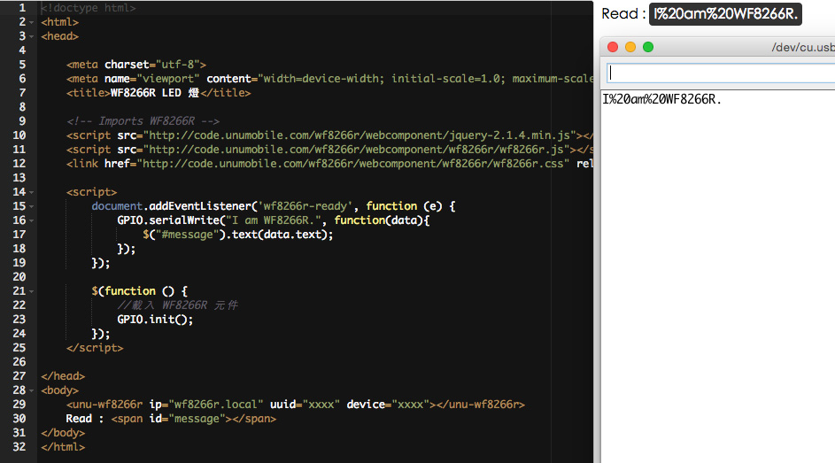

# 基礎篇 ： 串列傳輸




## 材料
* USB 轉 TTL 晶片 FTDI：用來和電腦溝通
* WF8266R

## 序列(串口) 傳輸



WF8266R 可以透過 Tx(該裝置的輸出訊號腳位) 和 Rx(該裝置的接收訊號腳位) 二腳和外部序列裝置進行資料互傳, 這個範例我們將示範如何透過 WEB 去調用 Rx Tx. 這裡要特別注意, WF8266R 使用電位為 3.3V 所以在 Rx 腳的最大電壓盡量在 4V 以內, 也就是其他設備透過自已 Tx 腳傳過來的電壓, 如果過高可能會燒壞 WF8266R.


## 配線
在了解 Rx 和 Tx 的功用後, 我們就能理解為何 WF8266R 的 Tx 腳要接到 TTL(紅色板子) 的 Rx 腳位, 而 TTL 的 Tx 則是接到 WF8266R 的 Rx.


## 傳輸速度 Baud 115200
WF8266R 預設的傳輸率是 115200, 請在網址列輸入 wf8266r.local 可查看 WF8266R 的內部資料:
```
UNU-WF8266R Infomation Center

Passport
IP : 192.168.0.26
Device : 15846477
UUID : 

Wi-Fi

SSID : UNUMoblie.com.1F
Password : 
AP SSID : UNU-WF8266R-274
AP Password : 
Local IP : 192.168.0.26
AP IP : 192.168.4.1

Device

Baud : 115200
Cloud : 0
UUID : 
Firmware : 2015.06.21
Free heap : 18328
Chip ID : 15846477
Flash chip ID : 1458376
Flash chip size : 4194304
Flash chip speed : 40000000
Time : 9:7:3
Running time : 0 day 1:7:3
```
其中, Baud : xxxx 即表示目前的使用速率, 那要如何修改 WF8266R 的 Baud 呢?

1. 使用網址列修改 : 請在網址列輸入以下網址, 這裡示範修改為 9600, 在按下送出後 WF8266R 會自動重新啟動.
```
http://wf8266r.local/serial?baud=9600
```
2. 使用 WEB 調用 : 在 GPIO 物件裡有個方法 serialBaud 可提供修改 WF8266R 的使用速率.

點我查看範例 這個範例在按下 RUN 會立即修改為指定速率並重新開機, 並顯示新的速率在畫面上.
```javascript
GPIO.serialBaud(9600, function(data){
    $("#message").text(data.baud);
});
```

## 讀取
WF8266R 目前配置了 255 個字元讀取緩衝區, 所以一次發送的最大長度為 255. 這裡示範由電腦端發送 Hello WF8266R 字串, 並透過 GPIO 物件的 serialRead 讀取.

[點我查看範例](http://code.unumobile.com/wf8266r/Default?templateName=06_SerialRead.html) 資料會存在 data.text 物件中, 只需將讀到的字串顯示於畫面上.
[](http://code.unumobile.com/wf8266r/Default?templateName=06_SerialRead.html)


## 寫入
WF8266R 可透過 GPIO.serialWrite 或是加上 換行 GPIO.serialWriteln 這二個方法將資料送到其他設備.

[點我查看範例](http://code.unumobile.com/wf8266r/Default?templateName=06_SerialWrite.html) 我們試著將 I am WF8266R. 這個字串送到電腦, 會發現空白變成了 %20, 這是 因為線上測試平台的安全性編碼, 目前版本已自動轉換，所以不會再看到%20.
[](http://code.unumobile.com/wf8266r/Default?templateName=06_SerialWrite.html)

## 線上練習

