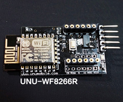

# 硬體
[WF8266R.js](http://code.unumobile.com/wf8266r/Release) 只要是ESP8266 4MB記憶體的封裝都可以支援。目前市面上使用這個封裝的硬體如下：

## WF8266R

* WF8266R Dev-Board
* WF8266T LED

## NodeMCU

* NodeMCU 1.0 Dev-Board

## Adafruit

* Adafruit HUZZAN ESP8266

