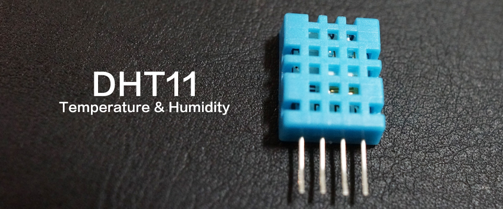
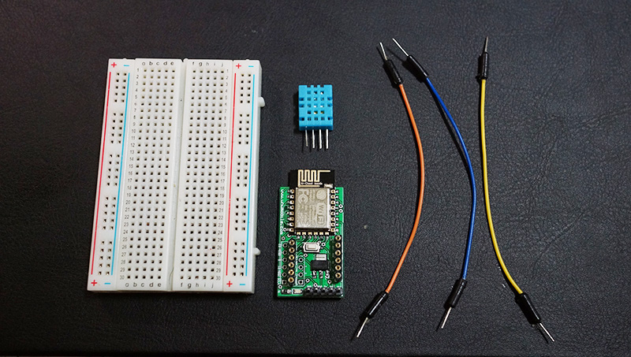
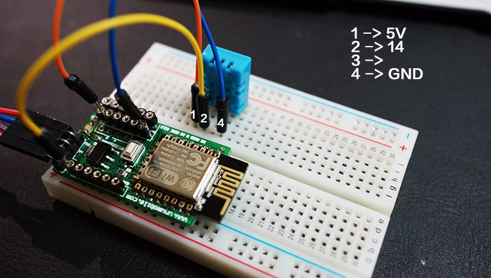
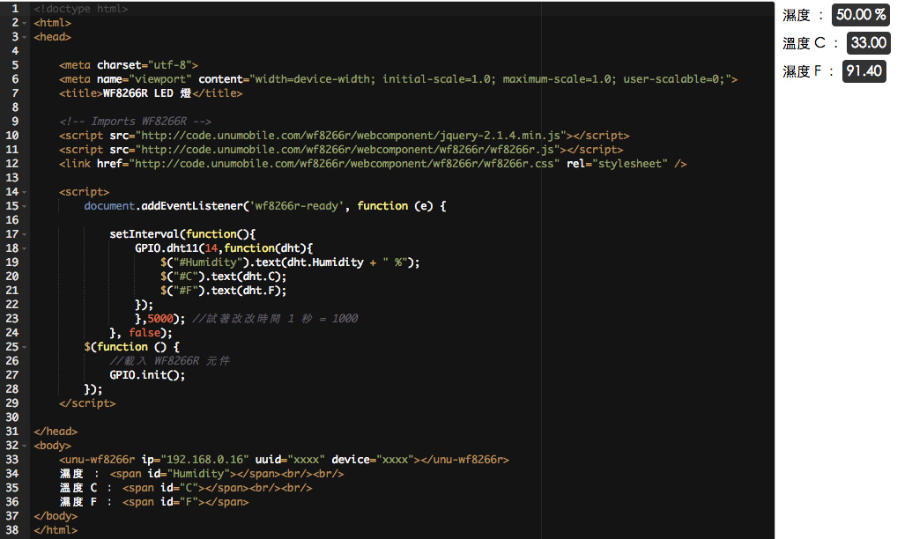

# 感測元件 : 溫濕度




## 材料



* 型號：DHT11
* 濕度 : 20% ~ 95%
* 溫度 : 0 ~ 50 度C
* 誤差 : 濕度 5% 溫度 2%
* VCC : 3~5V

##配線


##程式
要透過 DHT11 讀取目前的溫濕度時需要使用 GPIO.dht11 功能, 並指定 DHT11 的 Data 腳接在 WF8266R 的哪個腳位. 這個範例我們將 Data 接在 Pin 14. 所以我希望 5 秒取一次目前的環境 溫度 和 濕度 時就需要用到 setInterval 幫手.
```javascript
document.addEventListener('wf8266r-ready', function (e) {

    setInterval(function(){
        GPIO.dht11(14,function(dht){
            $("#Humidity").text(dht.Humidity + " %");
            $("#C").text(dht.C);
            $("#F").text(dht.F);
        });
        },5000); //試著改改時間 1 秒 = 1000
    }, false);
```
所以, 每 5 秒會得到溫濕度的資料放在 dht 這個物件之中. 在這個物件包含了3個屬性, 分別為 : 
* Humidity : 濕度
* C : 溫度單位 C
* F : 溫度單位 F

了解之後, 我們就可以將這 3 個資料放在畫面上的位置.

##完整範例
```html
<!doctype html>
<html>
<head>

    <meta charset="utf-8">
    <meta name="viewport" content="width=device-width; initial-scale=1.0; maximum-scale=1.0; user-scalable=0;">
    <title>WF8266R LED 燈</title>

    <!-- Imports WF8266R -->
    <script src="http://code.unumobile.com/wf8266r/webcomponent/jquery-2.1.4.min.js"></script>
    <script src="http://code.unumobile.com/wf8266r/webcomponent/wf8266r/wf8266r.js"></script>
    <link href="http://code.unumobile.com/wf8266r/webcomponent/wf8266r/wf8266r.css" rel="stylesheet" />

    <script>
        document.addEventListener('wf8266r-ready', function (e) {

            setInterval(function(){
                GPIO.dht11(14,function(dht){
                    $("#Humidity").text(dht.Humidity + " %");
                    $("#C").text(dht.C);
                    $("#F").text(dht.F);
                });
                },5000); //試著改改時間 1 秒 = 1000
            }, false);
        $(function () {
            //載入 WF8266R 元件
            GPIO.init();
        });
    </script>

</head>
<body>
    <unu-wf8266r ip="192.168.0.16" uuid="xxxx" device="xxxx"></unu-wf8266r>
    濕度 ： <span id="Humidity"></span><br /><br />
    溫度 C ： <span id="C"></span><br /><br />
    溫度 F ： <span id="F"></span>
</body>
</html>
```

## 線上練習

[](http://code.unumobile.com/wf8266r/Default?templateName=31_DHT.html)
