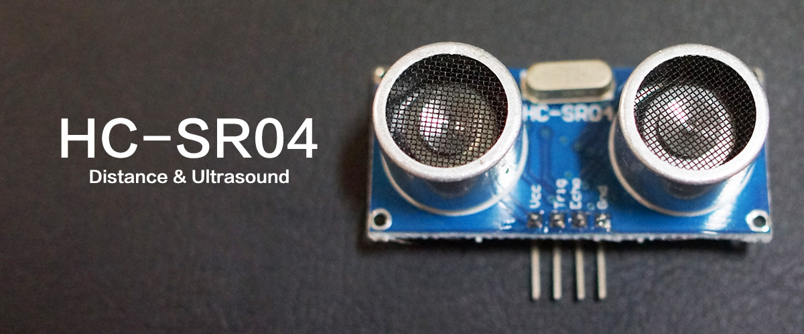
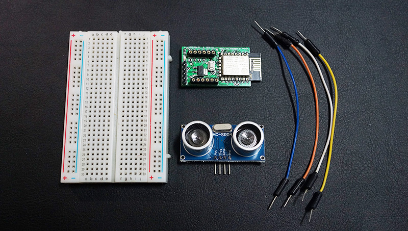
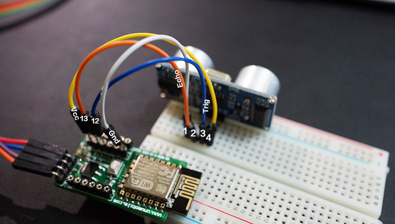
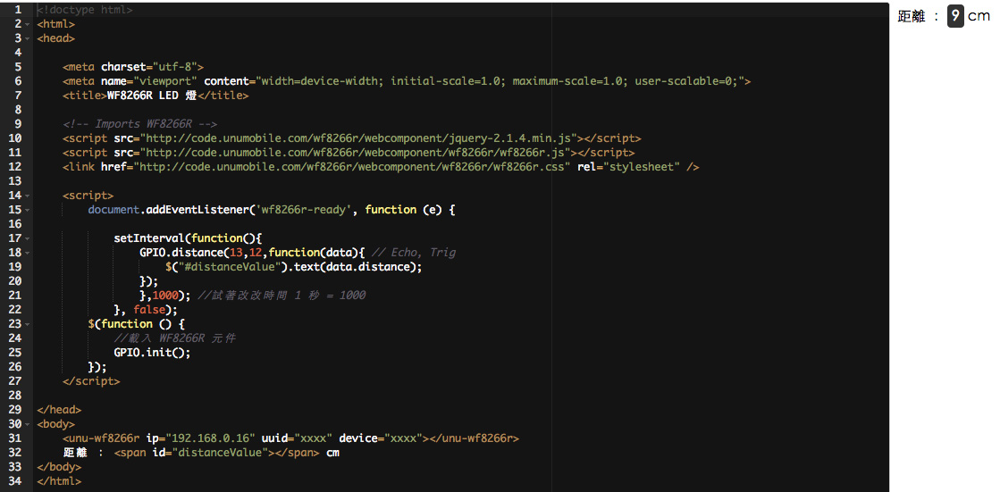

# 感測元件 : 超音波測距


##材料

* 型號：HC-SR04
* 探測的距離 : 2cm-400cm
* 精度 : 0.3 cm
* 感應角度 : 15 度
* VCC : 5V

##原理
超音波感測器是由超音波發射器、接收器和控制電路所組成。當它被觸發的時候，會發射一連串 40 kHz 的聲波並且從離它最近的物體接收回音。

聲音在空氣中的傳播速度大約是每秒 340 公尺，傳播速度會受溫度影響，溫度愈高，傳播速度愈快。假設以 340 公尺計算，1000000 / 340 * 100 = 29.4 microseconds，四捨五入後，可知聲音傳播 1 公分所需的時間為 29 microseconds (百萬分之一秒）。 由於超音波從發射到返迴是兩段距離，因此在計算時必須將結果除以 2 才是正確的物體距離。所以我們可以利用底下的公式算出物體距離 

（距離單位為公分，其中 timing 是測量得到的音波傳播時間）： timing / 29 / 2

音速的計算方式和溫度有關
c = 331.5 + 0.6 * [攝氏]
20°C的時候， c = 331.5 + 0.6 * 20 = 343.5 m/s

換算成每微秒(ųs)幾公分的話，那就是
c = 343.5 * 100 / 1000000 = 0.03435 cm/ųs

假設在20°C，WF8266R 計算的時間差 Δt 為 250 ųs，那麼測距就是
 250 * 0.03435 = 8.6 cm

除了用音速直接計算，也可以用速度的倒數(pace)來計算
The Pace of Sound = 1 / Speed of Sound = 1 / 0.03435 = 29.1 ųs/cm
因此距離就可以用 D = 250 / 29.1 = 8.6 cm

##配線


在理解完原里之後相必已經知道 Echo 和 Trig 這二個腳的用意了吧. 現在把他們分別接到 Pin 13 和 Pin 12, 然後一起體驗下正的範例程式吧!

##程式
同樣的, 我們需要利用 setInterval 這個幫手來每秒鐘取一次目前的距離. 其中會透過 GPIO.distance 這個功能向 WF8266R 發出請求, 當資料回傳時便會儲存在 data 物件中, 只需透過 data.distance 就可以拿到距離值了. 在使用 distance 時會傳入2個參數, 分別是 Echo 和 Trig, 這個範例我們是將 Echo 接在 Pin 13 所以第一個參數代 13, Trig 則是 12.

```javascript
setInterval(function(){
               GPIO.distance(13,12,function(data){ // Echo, Trig
                   $("#distanceValue").text(data.distance);
               });
               },1000); //試著改改時間 1 秒 = 1000
           }, false);

```
##完整範例
```html
<!doctype html>
<html>
<head>

    <meta charset="utf-8">
    <meta name="viewport" content="width=device-width; initial-scale=1.0; maximum-scale=1.0; user-scalable=0;">
    <title>WF8266R LED 燈</title>

    <!-- Imports WF8266R -->
    <script src="http://code.unumobile.com/wf8266r/webcomponent/jquery-2.1.4.min.js"></script>
    <script src="http://code.unumobile.com/wf8266r/webcomponent/wf8266r/wf8266r.js"></script>
    <link href="http://code.unumobile.com/wf8266r/webcomponent/wf8266r/wf8266r.css" rel="stylesheet" />

    <script>
        document.addEventListener('wf8266r-ready', function (e) {

            setInterval(function(){
                GPIO.distance(13,12,function(data){ // Echo, Trig
                    $("#distanceValue").text(data.distance);
                });
                },1000); //試著改改時間 1 秒 = 1000
            }, false);
        $(function () {
            //載入 WF8266R 元件
            GPIO.init();
        });
    </script>

</head>
<body>
    <unu-wf8266r ip="192.168.0.16" uuid="xxxx" device="xxxx"></unu-wf8266r>
    距離 ： <span id="distanceValue"></span> cm
</body>
</html>
```
##線上練習
[](http://code.unumobile.com/wf8266r/Default?templateName=32_Distance.html)