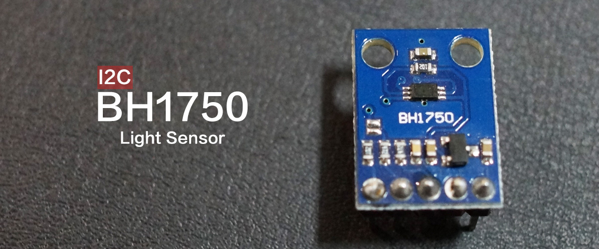
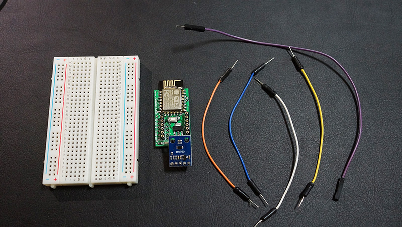
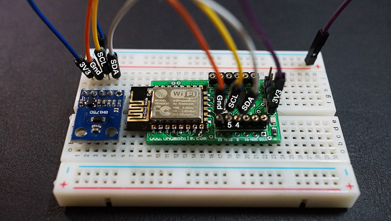
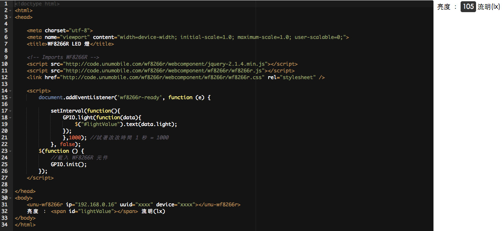

# 感測元件 : 流明度量 I2C


##材料


* 型號：BH1750
* 作業溫度 : -40 ~ 85 C
* VCC : 2.4 ~ 4.5V
###注意
這個模組使用的標準電位為 3.3V, 所以 VCC 的部份需要接 3V3, 雖然接 5V 不會立即燒掉, 但用久了一定會壞。

##配線


BH1750 共有5個腳位, 由上面圖片由左到右分別是 VCC GND SCL SDA ADDR. 因此我們需要依腳位定義分別和 WF8266R 連結. 其中 ADDR 為空接, 表示服務位址為 0x23, 如果接到 VCC 時服務位址為 0x5C.

##程式
利用 setInterval 這個幫手每秒鐘讀取一次目前的流明度. 其中會透過 GPIO.light 這個功能向 WF8266R 發出請求, 當資料回傳時便會儲存在 data 物件中, 只需透過 data.light 就可以拿到流明值了. 在使用 light 並無法指定另外的腳位, 因為 BH1750 是採用 I2C 通訊, 在 WF8266R 的 I2C 接腳分別是 PIN4 SDA 和 PIN5 SCL.
```javascript
setInterval(function(){
    GPIO.light(function(data){
        $("#lightValue").text(data.light);
    });
    },1000); //試著改改時間 1 秒 = 1000
}, false);
```
##完整範例
```html
<!doctype html>
<html>
<head>

    <meta charset="utf-8">
    <meta name="viewport" content="width=device-width; initial-scale=1.0; maximum-scale=1.0; user-scalable=0;">
    <title>WF8266R LED 燈</title>

    <!-- Imports WF8266R -->
    <script src="http://code.unumobile.com/wf8266r/webcomponent/jquery-2.1.4.min.js"></script>
    <script src="http://code.unumobile.com/wf8266r/webcomponent/wf8266r/wf8266r.js"></script>
    <link href="http://code.unumobile.com/wf8266r/webcomponent/wf8266r/wf8266r.css" rel="stylesheet" />

    <script>
        document.addEventListener('wf8266r-ready', function (e) {

            setInterval(function(){
                GPIO.light(function(data){
                    $("#lightValue").text(data.light);
                });
                },1000); //試著改改時間 1 秒 = 1000
            }, false);
        $(function () {
            //載入 WF8266R 元件
            GPIO.init();
        });
    </script>

</head>
<body>
    <unu-wf8266r ip="192.168.0.16" uuid="xxxx" device="xxxx"></unu-wf8266r>
    亮度 ： <span id="lightValue"></span> 流明(lx)
</body>
</html>
```
##線上練習
[](http://code.unumobile.com/wf8266r/Default?templateName=33_Light.html)