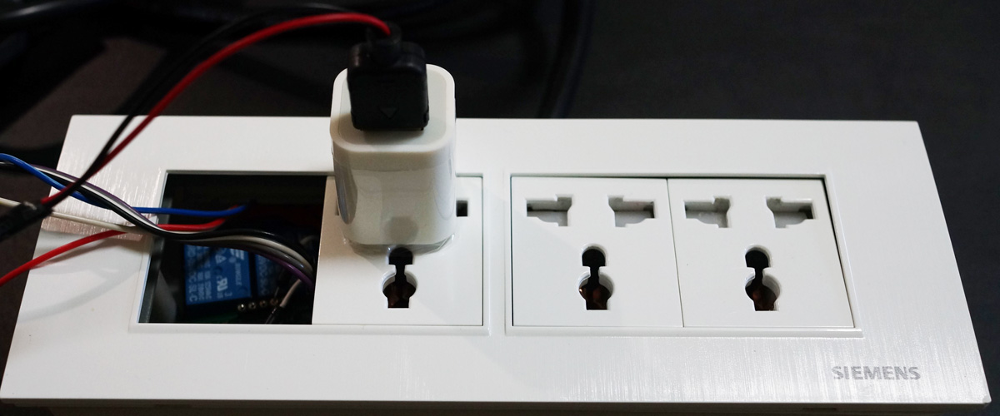
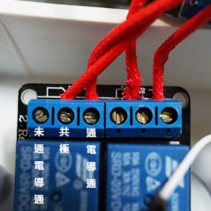
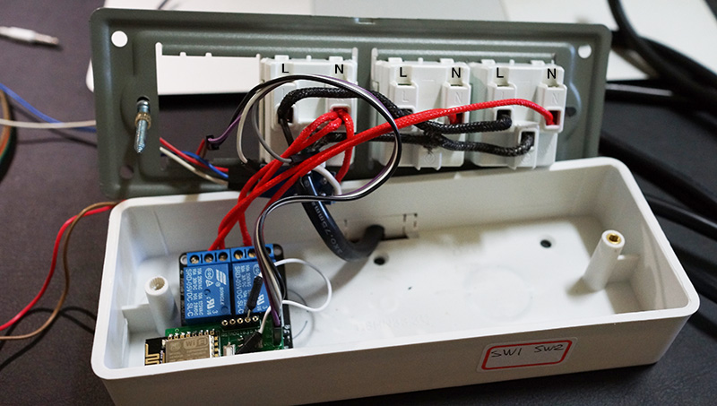
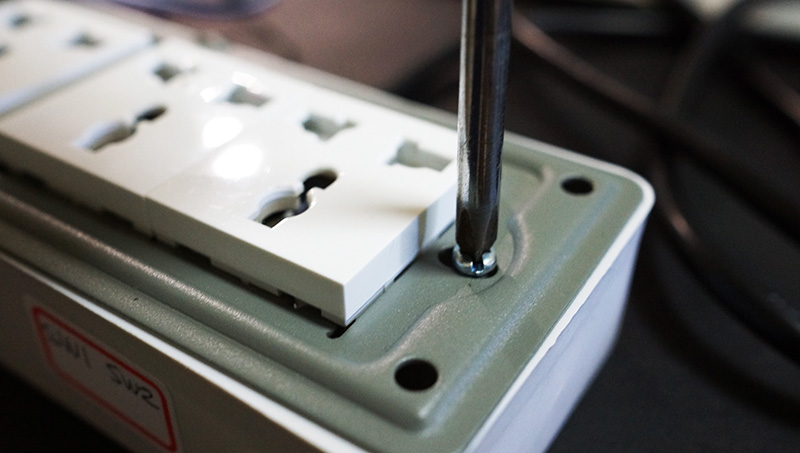
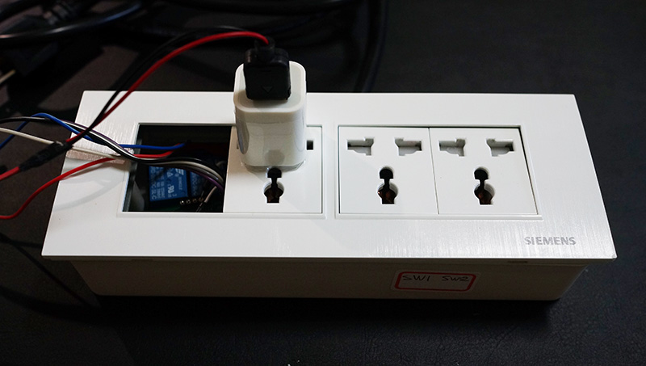
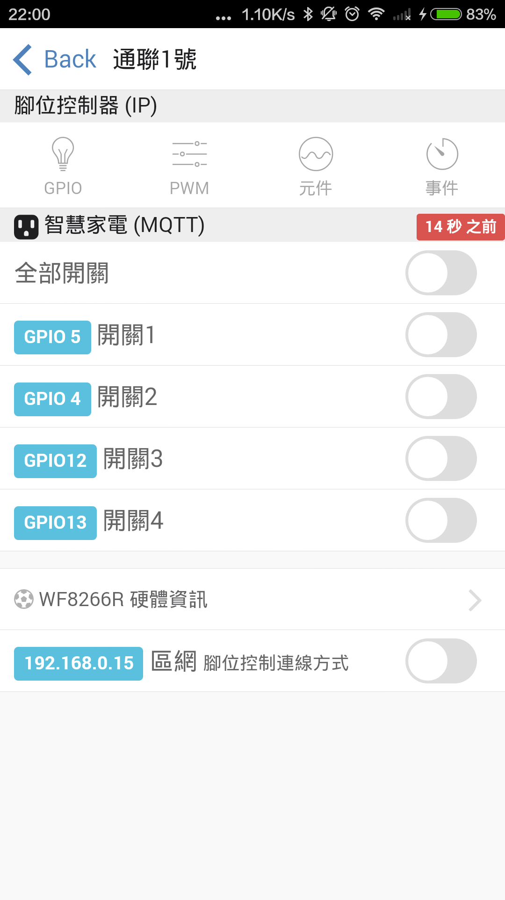

# 智慧家電 ： 連接繼電器

這個單元我們會透過 WF8266R 控制繼電器的開與關來讓插座通電和不通電. 立即升級成為智慧插座, 藉由雲端的服務提供你在戶外可以遠端控制開關, 並且使用排程功能, 讓插座依規劃的時間自動開啟或關閉.

更進階的玩法, 可以設定當什麼條件成立時開啟或關閉插座電源哦!

## 材料
* 4連 插座明盒 x 1
* 國際通用插座 x 3
* 2路繼電器 x 1
* WF8266R x 1

## 配線
###繼電器原理

繼電器會有3個接點, 大部份中間是 共用, 如圖片 左側是常閉, 也就是沒有通電時 左邊和中間是導通的. 而右側的是常開, 需要透過加電控制才能導通.

因此, 我們希望如果發生什麼事情時能自動斷電, 那就要把線接在 第2 和第3, 這樣在無供電情況下就不導通, 另一方面也可以省電. 原因是電器插在插座上, 就算沒有開啟也會有一定的負載耗電, 但在繼電器的設計是完全斷開的, 就像沒有把插頭插上一樣, 因此就不會有負載產生.

在接線的部份是採用併聯, 也就是將 3 個插座的 L 全部和電源線的 L 相接, N 和 接地也是同樣接法. 完成後會是如下圖的配置. 

確定都有接好, 不要有線互相露出後就完成了, 再把面板鎖在外盒上, 並蓋回最外面的面蓋, 這樣就完成了. 

## 完成組合

這樣就完成基本配置了, 在3個插座中 右邊2個分別是對應到繼電器2路, 而最左邊是沒有受繼電器控制的, 因此拿來給 WF8266R 供電使用. 當然可以把變壓器放在盒子內, 直接接電使用, 就不會占用一個插座.

## WF8266R 物聯雲 APP
可以到 Google Play 和 Apple Store 輸入關鍵字 WF8266R

